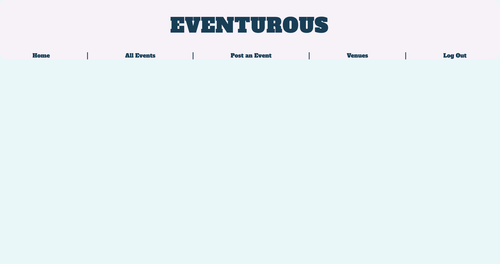
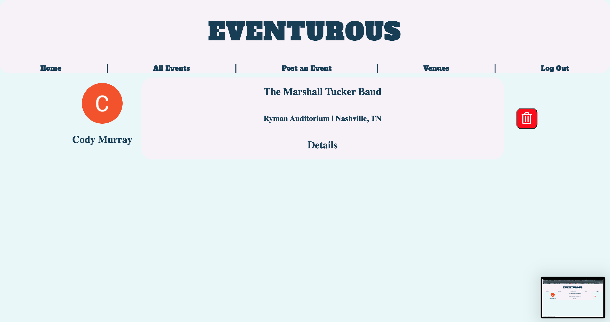
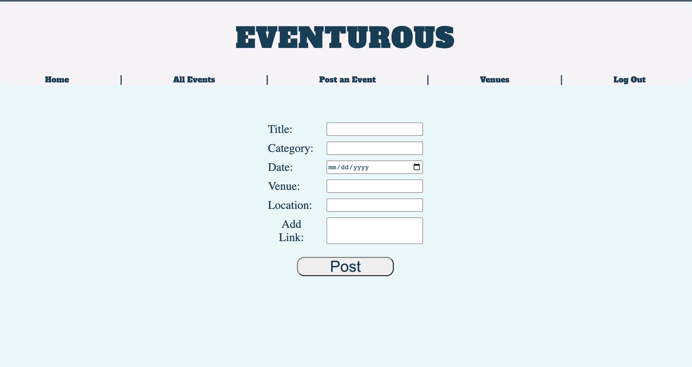
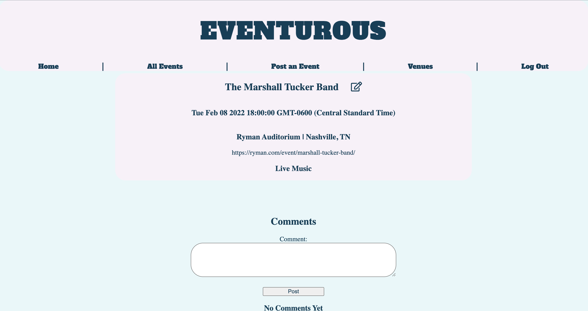
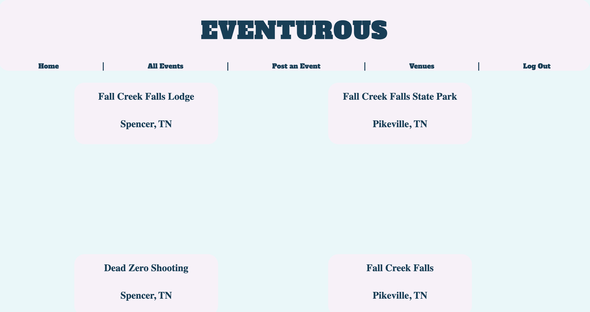

# Eventurous

## About

Eventurous is a platform based around social event planning in the user's local area. 

---

## Screenshots

---

## Tech Used

Full stack CRUD application implementing RESTful server-side routing as well as the consumption of Google OAuth and Foursquare Places APIs.

Built with:

-Mongoose/MongoDB

-Express.JS

-Node.JS

-Client-side Vanilla Javascript

-EJS/HTML

-CSS

---

## Getting Started

Upon entering the site, user is prompted to login/sign-up via Google authentication. Once successfully logged in, user will see a list of posts made by other users regarding local events they are interested in. Try it out: [Eventurous](https://eventurous-night-out.herokuapp.com/)

[Trello](https://trello.com/b/rzqfyvkn/eventurous)

---

## Next Steps

-Add categories feature 

-Add list of localities to categorize posts

-Add trending feature